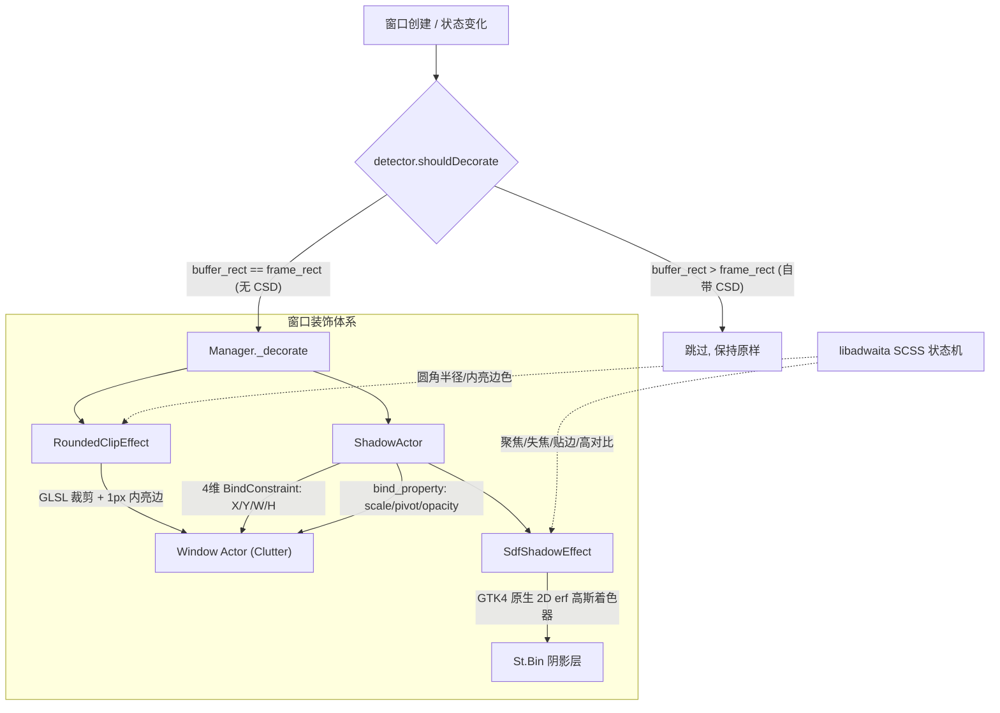

# CSD Fixer

给 GNOME Wayland 桌面下**缺少客户端装饰（Client-Side Decorations, CSD）** 的应用（如 Qt 应用、微信 Linux 官方版、旧版 Electron 或无边框应用等），补齐与 GNOME 原生应用**100% 数学同源**的圆角、内高光与高斯柔和阴影，消除桌面视觉割裂感。

---

## 为谁设计？（Target Audience）

- **追求视觉统一与原生质感的 GNOME 用户**：在使用清一色精致圆角、柔和阴影的 libadwaita 应用时，受不了突然弹出的微信、Qt 工具或第三方应用顶着生硬的直角、粗糙的阴影或直接缺少阴影。
- **“开箱即用、拒绝折腾”的用户**：不需要手动写 CSS，不需要为每个应用反复调参、设黑名单。本插件**严格对齐 GNOME 官方视觉规范**，全自动根据窗口生命周期与桌面状态（聚焦、失焦、分屏贴边、最大化、全屏、高对比度）无感切换。
- **性能与稳定性强迫症**：不能容忍窗口拖动缩放时丢帧、不能容忍关闭窗口时圆角闪烁退化为直角、不能容忍终端后台疯狂刷出 `Clutter-WARNING` 警告日志。

---

## 为什么选择 CSD Fixer？（对比 Rounded Window Corners）

在 GNOME 社区中，为非原生窗口补充圆角的经典扩展是 `rounded-window-corners-reborn` (rwc)。两者在设计哲学与底层实现架构上有本质区别：

| 评估维度 | CSD Fixer (本项目) | rounded-window-corners (rwc) | 体验与技术差异 |
| :--- | :--- | :--- | :--- |
| **阴影生成机制** | **纯 GPU 片段着色器数学积分**<br>（GTK4 GSK 原版同源算法） | **CSS 引擎渲染 9-slice 离线贴图**<br>（依赖 Mutter 的 `clutter_blur_node` 离线光栅化） | 离线贴图在窗口尺寸变化时可能出现拉伸接缝与显存开销；GPU 着色器纯数学解析积分，**零贴图显存占用，边缘无损平滑**。 |
| **阴影算法纯正度** | **100% 还原 GTK4 / libadwaita**<br>（二维误差函数 $\text{erf}$ 乘积 + 8 步缺角积分） | **CSS 阴影盒模拟** | 传统 1D 距离近似在四个圆角外侧会发胖、过亮；CSD Fixer 数值与 GTK 原生阴影在小数点后 6 位绝对吻合。 |
| **边缘接缝与暗带** | **互补几何遮罩（Complementary Coverage）**<br>（$A_{clip} + A_{shadow} \equiv 1.0$） | 传统裁切与贴图外扩叠加 | 彻底杜绝浅色窗口边缘由于透明抗锯齿露出底层黑色阴影而产生的“深灰暗带”，同时高分屏下绝无漏光亮缝。 |
| **尺寸跟随与性能** | **4 维底层 C 核心原子约束**<br>（X / Y / WIDTH / HEIGHT 约束绑定） | JS 监听窗口尺寸变化调用 `set_size` | 彻底根除在 allocation 阶段修改布局引发的 `Can't update stage views ... needs an allocation` 警告，无 JS 帧开销。 |
| **动效缩放同步** | **全维属性同步**<br>（scale, pivot, translation, opacity） | 阴影跟随动画较生硬或延迟 | 窗口打开、关闭、最小化动画期间，阴影与窗口完全贴合缩放，绝无“窗口缩放但阴影悬空”的视觉脱节。 |
| **窗口关闭体验** | **自然延迟自毁**（随 Actor destroy 自然谢幕） | 窗口 unmanaging 立即卸载效果 | 彻底消除窗口关闭动画中圆角提前失效、关闭按钮瞬间脱出圆角的直角闪烁。 |
| **设计哲学** | **零人工配置、零魔改猴子补丁**<br>（样式与算法由脚本直连上游仓库生成） | 提供丰富的手动调参 GUI、白名单规则、自定义圆角与阴影 | CSD Fixer 专注一件事并做到极致：让非 CSD 窗口在 GNOME 下呈现完全像原生应用的质感。 |

---

## 核心技术特性

### 1. GTK4 原生 2D 解析高斯着色器流水线
阴影不再是近似的模糊贴图，而是通过 `tools/gen-shader.mjs` 自动转译 GTK4 GSK 的渲染核心（`gskgpuboxshadow.glsl`）：
- 利用高斯误差函数（$\text{erf}$）的双重乘积计算二维盒式模糊积分，CSS 模糊半径与标准差严格换算（$\sigma = \frac{blur}{2}$）；
- 针对圆角外侧的缺角区域，在四个角落分别进行 8 步数值积分扣减，根除 1D SDF 近似阴影在圆角处的凸起和过亮；
- 保证生成的阴影无论在边缘平直区还是圆角过渡处，与 GNOME 官方 libadwaita 窗口的渲染结果**像素级一致**。

### 2. 互补几何遮罩（Complementary Alpha Coverage）
- 窗口 Actor 挂载 `RoundedClipEffect` 进行圆角裁剪与 1px 原生内亮边（libadwaita outline）渲染；
- 阴影 Actor 挂载 `SdfShadowEffect`，在其内部以严格互补的数学公式计算覆盖率：
  $$\text{Window Alpha} = 1.0 - \text{clamp}(d + 0.5, 0.0, 1.0)$$
  $$\text{Shadow Mask Alpha} = \text{clamp}(d + 0.5, 0.0, 1.0)$$
- 两个遮罩之和在边缘过渡带恒等于 $1.000000$。浅色窗口边缘不再透出底层的黑色阴影形成脏暗圈，同时在高分屏与分数缩放（Fractional Scaling）下绝无白边漏光。

### 3. 全底层 C 核心约束与动效同步
- **4 维约束**：阴影 Actor 的 X、Y、Width、Height 四个维度全部绑定 `Clutter.BindConstraint`。窗口调整大小时，完全在 Mutter 的底层 C 语言合成流水线中完成，零 JS 布局调用；
- **全动效跟随**：通过 `GObject.bind_property` 同步缩放比例（`scale-x`、`scale-y`）、变换支点（`pivot-point`）、平移量（`translation`）与透明度（`opacity`），阴影在窗口打开、缩放、最小化动效中全程丝滑贴合；
- **自然谢幕**：在窗口 `unmanaging` 阶段不提前拔除效果，保持圆角裁剪与阴影存活，随窗口 Actor 销毁信号安全析构，根除关闭时直角跳闪。

### 4. 样式与算法自动化流水线
本插件不设主观臆造的样式参数：
- `tools/gen-style.mjs`：自动解析上游 `vendor/libadwaita` 的 SCSS 源码，提取并生成聚焦、失焦（backdrop）、分屏（tiled）、全屏、高对比度等完整状态机；
- `tools/gen-shader.mjs`：自动提取并转译 `vendor/gtk` 的 GSK 片段着色器；
- 支持 `npm run check-style` 作为质量门禁，在上游更新时一键检测视觉与算法一致性。

---

## 架构与数据流



---

## 代码结构

```
src/
  extension.js                   扩展入口
  metadata.json                  元数据声明（UUID、支持版本）
  lib/
    detector.js                  CSD 检测判据（纯函数，可单测）
    manager.js                   生命周期与信号状态机（窗口增删/状态切换）
    style.js                     样式状态机（根据窗口状态分发参数）
  effects/
    clipEffect.js                圆角裁剪 + 内亮边 GLSL 着色器效果
    shadowActor.js               阴影独立 Actor 容器（4维约束与动效同步）
    shadowEffect.js              GTK4 2D 高斯解析阴影着色器效果
    shadowShader.generated.js    GTK4 GSK 着色器自动转译产物（勿手改）
  style/
    defaults.js                  libadwaita 样式自动生成产物（勿手改）
vendor/
  gtk/                           GTK4 GSK 原生 gskgpuboxshadow.glsl 与 commit
  libadwaita/                    上游 SCSS 源码与 commit
tests/                           jasmine-gjs 单元测试（23 specs）
tools/
  devkit.sh                      GNOME 50 devkit 嵌套开发会话工具
  dev.sh                         无头嵌套会话开发工具
  gen-shader.mjs                 着色器转译器（GTK GLSL -> GJS GLSL）
  gen-style.mjs                  样式生成器（SCSS -> defaults.js）
```

---

## 开发与质量门禁

### 前置工具（安装在 `~/.local`，不入库）

```sh
# 1) jasmine-gjs：单测运行时（GNOME 官方，meson 构建）
git clone https://github.com/ptomato/jasmine-gjs /tmp/jasmine-gjs
meson setup /tmp/jasmine-gjs/_build /tmp/jasmine-gjs --prefix=$HOME/.local
ninja -C /tmp/jasmine-gjs/_build install

# 2) gnome-extension-reviewer：扩展质量门禁（ego-lint）
git clone https://github.com/ZviBaratz/gnome-extension-reviewer.git \
    ~/.local/share/gnome-extension-reviewer
printf '#!/usr/bin/env bash\nexec bash ~/.local/share/gnome-extension-reviewer/ego-lint "$@"\n' \
    > ~/.local/bin/ego-lint
chmod +x ~/.local/bin/ego-lint
```

### 日常开发命令

```sh
# 运行全部单元测试
npm test

# 校验样式与着色器与上游的一致性
npm run check-style

# 运行 GNOME 扩展官方审查静态检查
~/.local/bin/ego-lint src/

# 启动 GNOME 50 嵌套开发会话（真实渲染管线，主桌面零接触）
./tools/devkit.sh
```

---

## 许可协议

GPL-3.0-or-later
