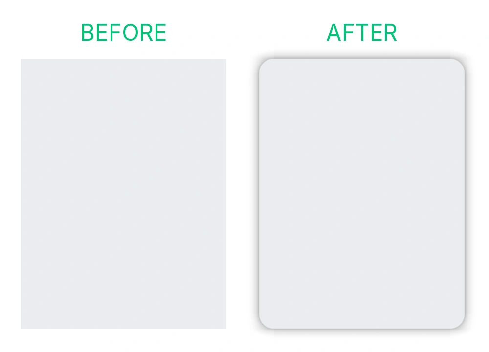

# CSD Fixer

[English](README.md) | [简体中文](README.zh-CN.md)

Gives GNOME's rounded corners and drop shadows to undecorated windows.



## What it does

- **Fills the gaps, nothing else.** Decorates windows that neither draw their own decoration
  nor get one from Mutter: WeChat, most Qt and Electron apps, frameless X11 clients. Two
  shadows can't stack on one window.
- **Native GNOME experience.** Rounded corners, shadow and outline match a GNOME window in
  every state: focused, backdrop, tiled, maximized, fullscreen, high contrast. The values
  come from libadwaita.
- **Stays sharp under fractional scaling.** An option drops the rounding and keeps the
  shadow, for sharper text.

## Rules

- **Force Rules.** Use its pick button on a window that's still square, because it draws
  its own decoration or because CSD Fixer can't tell, and the rule covers that window kind
  from then on.
- **Suppress Rules.** The reverse: pick a window that has a decoration, and the rule
  strips it for that kind.
- **Per window kind, not per app.** A rule made for one of WeChat's dialogs does not apply
  to its main window.

## Installation

GNOME Shell 45–50, Wayland or X11.

```sh
git clone https://github.com/everyx/csd-fixer.git
cd csd-fixer
pnpm install
pnpm run install-ext
```

extensions.gnome.org: soon.

## Development

- **Commits run the CI checks.** `pnpm install` points git at `.githooks/`.
- **Model docs.** [docs/development.md](docs/development.md).

## License

GPL-2.0-or-later
